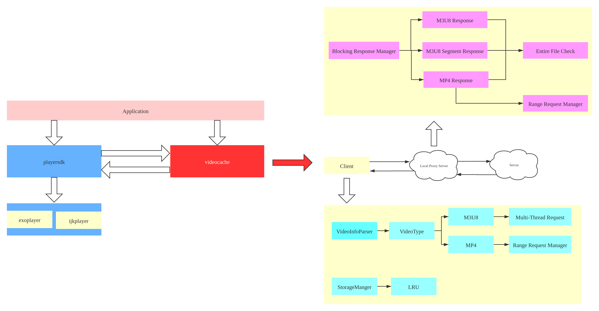

# JeffVideoCache
Better than AndroidVideoCache

Refer to the [English Development Document](./README_EN.md)

#### 开发文档
> * 1.实现脱离播放器的预加载功能
> * 2.实现视频的边下边播功能
> * 3.实现M3U8视频边下边播功能
> * 4.实现MP4视频的边下边播功能
> * 5.支持的播放器是exoplayer和ijkplayer
> * 6.支持接入okhttp
> * 7.支持拖动进度条之后继续缓存到本地的功能
> * 8.支持LRU清理规则, 可以设置缓存的过期时间

#### JeffVideoCache架构


JeffVideoCache 核心放在客户端, local server端和client做好数据同步的工作

##### 1.如何接入

###### 1.1 初始化
程序启动的时候设置JeffVideoCache ----> SDK初始化配置
```
File saveFile = StorageUtils.getVideoFileDir(this);
if (!saveFile.exists()) {
    saveFile.mkdir();
}
VideoProxyCacheManager.Builder builder = new VideoProxyCacheManager.Builder().
        setFilePath(saveFile.getAbsolutePath()).    //缓存存储位置
        setConnTimeOut(60 * 1000).                  //网络连接超时
        setReadTimeOut(60 * 1000).                  //网络读超时
        setExpireTime(2 * 24 * 60 * 60 * 1000).     //2天的过期时间
        setMaxCacheSize(2 * 1024 * 1024 * 1024);    //2G的存储上限
VideoProxyCacheManager.getInstance().initProxyConfig(builder.build());
```
初始化配置:
> * 1.设置缓存存储的路径
> * 2.设置链接超时时间
> * 3.设置网络读超时的时间
> * 4.设置缓存的过期时间
> * 5.设置最大缓存的限制

###### 1.2 构建本地代理url
```
playUrl = ProxyCacheUtils.getProxyUrl(uri.toString(), null, null);

public static String getProxyUrl(String videoUrl, Map<String, String> headers, Map<String, Object> cacheParams)
```
可以传入headers, 也可以传入其他额外参数,根据你们自己的需求来

构建的url主要是base64编码的

###### 1.3 发起请求
```
VideoProxyCacheManager.getInstance().startRequestVideoInfo(videoUrl, headers, extraParams);

public void startRequestVideoInfo(String videoUrl, Map<String, String> headers, Map<String, Object> extraParams)
```

###### 1.4 设置缓存监听
```
VideoProxyCacheManager.getInstance().addCacheListener(videoUrl, mListener);

其中mListener如下:

public interface IVideoCacheListener {

    void onCacheStart(VideoCacheInfo cacheInfo);

    void onCacheProgress(VideoCacheInfo cacheInfo);

    void onCacheError(VideoCacheInfo cacheInfo, int errorCode);

    void onCacheForbidden(VideoCacheInfo cacheInfo);

    void onCacheFinished(VideoCacheInfo cacheInfo);
}
```

###### 1.5 设置正在播放链接
```
VideoProxyCacheManager.getInstance().setPlayingUrlMd5(ProxyCacheUtils.computeMD5(videoUrl));
```

###### 1.6 暂停缓存任务
```
VideoProxyCacheManager.getInstance().pauseCacheTask(mVideoUrl);
```

###### 1.7 恢复缓存任务
```
VideoProxyCacheManager.getInstance().resumeCacheTask(mVideoUrl);
```

###### 1.8 拖动进度条
```
long totalDuration = mPlayer.getDuration();
if (totalDuration > 0) {
    float percent = position * 1.0f / totalDuration;
    VideoProxyCacheManager.getInstance().seekToCacheTaskFromClient(mVideoUrl, percent);
}
```

###### 1.9 释放缓存任务
```
VideoProxyCacheManager.getInstance().stopCacheTask(mVideoUrl);   //停止视频缓存任务
VideoProxyCacheManager.getInstance().releaseProxyReleases(mVideoUrl);
```

#### Development Document
> * 1.It can play the video while caching it
> * 2.It supports M3U8 , MP4 and so on
